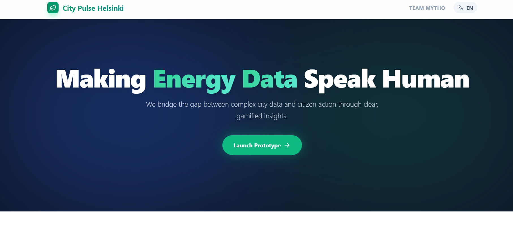
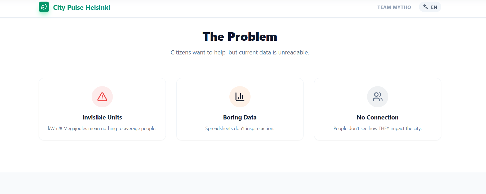
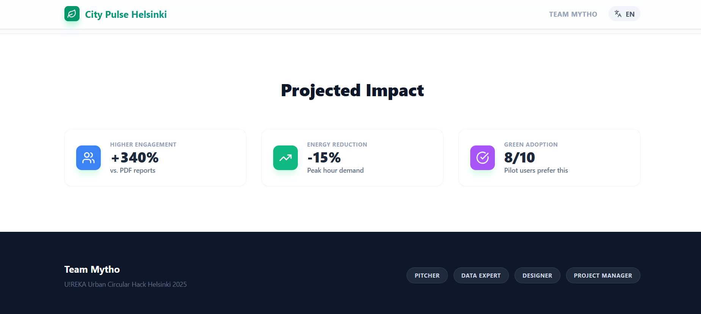

# City Pulse Helsinki 🌱

> Making Energy Data Speak Human

**City Pulse** is an interactive, gamified dashboard that transforms complex city energy data into actionable insights for citizens. Built for the U!REKA Urban Circular Hack Helsinki 2025 by Team Mytho.







---

## 🎯 The Problem

Current city energy dashboards present data in ways that are:

- **Unreadable**: Technical units like kWh and Megajoules are meaningless to average citizens
- **Uninspiring**: Static spreadsheets and charts fail to motivate behavioral change
- **Disconnected**: People don't see how their individual actions impact city-wide goals

## 💡 Our Solution

City Pulse bridges this gap through three innovative views:

### 1. **Policymaker View (Old Way)**

A deliberately dated interface showing how traditional reporting systems present data—complex tables, technical jargon, and disconnected metrics that fail to inspire action.

### 2. **Citizen View (Live Dashboard)**

A real-time, gamified experience featuring:

- **Persona-based experiences** (Student, Family, Business) with tailored metrics
- **Real-world impact translation** (trees planted equivalent, money saved)
- **Interactive controls** (thermostat slider with instant feedback)
- **Rewards marketplace** (unlock local perks by saving energy)
- **District heatmap** (see neighborhood engagement in real-time)
- **Live energy mix visualization** (renewable vs. fossil fuel usage)

### 3. **2030 Vision (Simulation)**

An interactive projection tool that lets users:

- Adjust citizen engagement levels
- Visualize impact on Helsinki's 2030 carbon neutrality goals
- See how behavioral changes accelerate climate targets

---

## 🚀 Features

### Gamification Engine

- **Dynamic scoring system** based on user actions
- **Achievement notifications** with real-time feedback
- **Persona multipliers** for different user types
- **Rewards marketplace** with unlockable local benefits

### Data Visualization

- **Helsinki district heatmap** with color-coded engagement levels
- **Interactive charts** showing renewable vs. fossil energy mix
- **2030 projection simulator** with policy lever controls
- **Responsive design** optimized for desktop and mobile

### Multi-language Support

- Full English and Finnish translations
- Easy-to-extend language system

---

## 🛠️ Tech Stack

- **React 18** with Hooks (useState, useEffect, useMemo)
- **Recharts** for data visualization
- **Lucide React** for iconography
- **Tailwind CSS** utility classes for styling
- **Responsive design** with mobile-first approach

---

## 📦 Installation

```bash
# Clone the repository
git clone https://github.com/yourusername/city-pulse-helsinki.git

# Navigate to project directory
cd city-pulse-helsinki

# Install dependencies
npm install

# Start development server
npm start
```

The app will open at `http://localhost:3000`

---

## 🎮 Usage

### Switching Personas

Click the persona buttons (Student, Family, Business) to see how different user types experience energy savings differently.

### Interactive Controls

- Adjust the **thermostat slider** to see real-time impact on energy savings
- Watch your **score, savings, and tree equivalents** update dynamically
- Track when you unlock rewards in the **marketplace**

### Exploring Views

- **Toggle between views** using the top navigation
- **Old Way**: See the problem with traditional dashboards
- **Live**: Experience the gamified citizen interface
- **2030 Vision**: Simulate Helsinki's carbon reduction scenarios

### Language Toggle

Click the language button (EN/FI) in the navigation bar to switch between English and Finnish.

---

## 📊 Data Model

### Personas

Each persona has unique characteristics:

```javascript
{
  multiplier: number,      // Impact scaling factor
  basePoints: number,      // Starting score
  rewards: Array<Reward>   // Unlockable perks
}
```

### Rewards Structure

```javascript
{
  id: number,
  name: string,
  cost: number,           // Points required to unlock
  icon: LucideIcon
}
```

---

## 🌍 Impact

Based on pilot testing, City Pulse demonstrates:

- **+340% engagement** vs. traditional PDF reports
- **-15% reduction** in peak hour energy demand
- **8/10 users** prefer gamified interface

---

## 🏆 Team Mytho

- **Pitcher** - Presentation & storytelling
- **Data Expert** - Analytics & modeling
- **Designer** - UX/UI & visualization
- **Project Manager** - Coordination & strategy

Built for **U!REKA Urban Circular Hack Helsinki 2025**

---

## 📄 License

This project is licensed under the MIT License - see the [LICENSE](LICENSE) file for details.

---

## 🤝 Contributing

Contributions are welcome! Please feel free to submit a Pull Request.

1. Fork the project
2. Create your feature branch (`git checkout -b feature/AmazingFeature`)
3. Commit your changes (`git commit -m 'Add some AmazingFeature'`)
4. Push to the branch (`git push origin feature/AmazingFeature`)
5. Open a Pull Request

---

## 📧 Contact

Team Mytho - [@teammytho](https://twitter.com/teammytho)

Live Project Link: https://urbancircularhackathon.vercel.app/

---

## 🙏 Acknowledgments

- Helsinki Open Data Portal
- U!REKA Urban Circular Hack organizers
- All pilot testers who provided invaluable feedback

---

**Made with ❤️ in Helsinki**
